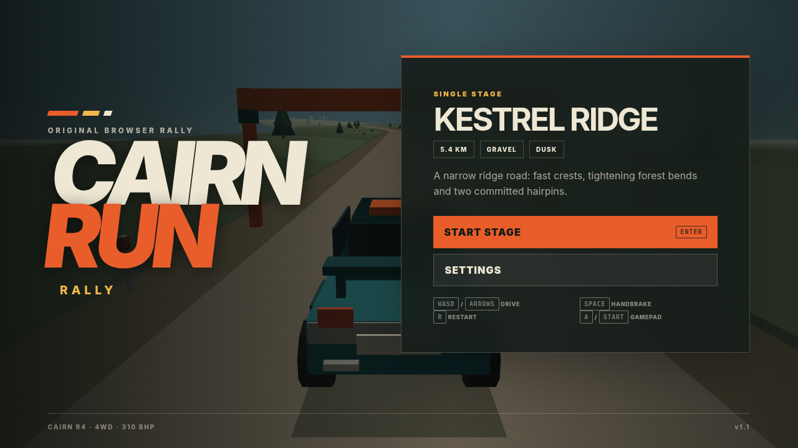
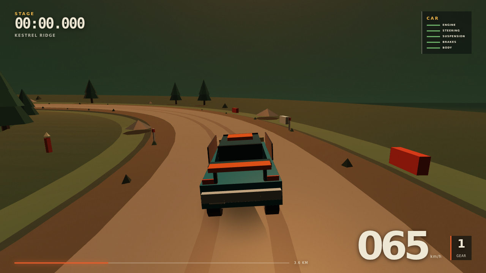

# Cairn Run Rally

**Cairn Run Rally** is an original, self-contained point-to-point browser rally game. Version 1.1 is built around one polished 5.405 km gravel stage, controllable loose-surface handling, authored co-driver calls, lightweight damage, fast retry, and a restrained late-1990s-inspired low-poly presentation.





## Run it

Requirements: a modern desktop browser with WebGL2 and Node.js 18 or newer.

```bash
npm start
```

Open the printed address, normally `http://127.0.0.1:4173`.

There are **no package dependencies and no install step**. All code, shaders, geometry, effects, and spoken pace-note audio are in this repository.

## Controls

| Action | Keyboard | Gamepad |
|---|---|---|
| Accelerate | A / Up | Right trigger / A |
| Brake / reverse | Z / Down | Left trigger / B |
| Steer | ,/. or Left/Right | Left stick |
| Handbrake | Space | X |
| Pause / resume | Escape | Menu / Start |
| Restart | R | Y |
| Confirm | Enter | A |
| Navigate menus | Arrows | D-pad |
| Fullscreen | Double-click the game view | — |

Gamepad state is cleared on disconnect, reconnect, pause, and screen transitions so a lost controller cannot leave steering or throttle latched.

## The stage

**Kestrel Ridge** is an authored 5.405 km point-to-point route designed for roughly 3½–5 minutes. It contains:

- fast and medium bends, tightening corners, left/right combinations, and two hairpins;
- crests, dips, climbs, descents, a narrow bridge landmark, and readable braking zones;
- compact dirt, three loose-gravel sections, and heavily penalising grass;
- 18 authored pace notes with local spoken audio and optional on-screen cards;
- three timing controls, personal-best splits, a finish result, and immediate retry;
- authored collision boundaries for hazards, stone walls, hairpin barriers, and bridge rails.

Route sampling and nearest-road projection use actual cumulative stage distance rather than assuming perfectly uniform sample spacing. This keeps timing, recovery, collision placement, and finish geometry aligned along the entire route.

## Driving model

The car simulation runs at a fixed 120 Hz. It uses a front/rear tyre-force model with mass and yaw inertia rather than a rail-following or kart controller. The model includes:

- speed-sensitive progressive steering;
- front/rear slip angles and grip limits;
- braking load transfer and throttle influence on attitude;
- recoverable oversteer, countersteer, and handbrake rotation;
- correct steering direction while reversing;
- different friction and lateral retention on compact dirt, loose gravel, and grass;
- road grade, camber, crest airtime, landing impacts, body roll, and pitch;
- negligible tyre, steering, and drive authority while genuinely airborne;
- engine, steering, suspension, brake, and body damage with bounded consequences;
- collision impulses and automatic recovery only from genuinely stranded states;
- contact feedback separated from mechanical damage, so a slow scrape does not destroy the car.

## Camera and presentation

The chase camera blends vehicle yaw, velocity direction, and road heading. That makes oversteer readable without allowing a large slide to turn the camera completely away from the road. It also uses independent horizontal/vertical damping, speed-aware distance and field of view, terrain clearance, and restrained shake.

The renderer is a small local WebGL2 pipeline. It builds the road, shoulders, terrain, vegetation, rocks, walls, barriers, bridge, posts, spectators, gates, car, dust, skid particles, sky, fog, and lighting from original procedural geometry. It does not download external assets or contact external services.

Audio uses the Web Audio API for engine, transmission whine, wind, gravel, countdown, and collision effects. Co-driver lines are packaged in both MP3 and Ogg formats for broad desktop-browser compatibility.

## Quality checks

```bash
npm test       # 31 deterministic subsystem and adversarial regressions
npm run simulate
npm run smoke  # boots and drives the real browser build in Chromium
npm run review # captures title, settings, stage, pause, result, and high-DPI views
npm run qa     # test + simulation + browser smoke
```

The suite covers route continuity and exact endpoint sampling, pace-note ordering and stale-trigger recovery, restart time, split-order exploits, reverse crossings, acceleration, surface differences, oversteer/countersteer, reverse steering, airborne controls, low-speed settling, recovery-point safety, collision boundaries, gentle scrapes, bounded damage, long-session numerical stability, complete-stage driving, camera road context, packaged audio, full game-loop markup, gamepad start/pause/reconnect behaviour, high-DPI resize, low-quality fallback, trusted keyboard restart, runtime errors, draw calls, triangle count, heap use, and separate physics/render/GPU instrumentation.

At packaging time, all **28/28 tests** pass. The deterministic stage driver finishes in **290.47 seconds** with **0 recoveries**, all **18/18 pace calls**, **3 contacts**, and **3.7% aggregate damage**. Those contacts are reported rather than described as a clean run.

See [the benchmark](docs/BENCHMARK.md), [gauntlet log](docs/GAUNTLET_LOG.md), [adversarial review](docs/ADVERSARIAL_REVIEW.md), and [quality report](docs/QUALITY_REPORT.md) for critic findings, fixes, measurements, and remaining validation boundaries.

## Project structure

```text
index.html                  Game shell and menus
src/stage.js                Authored route, surfaces, hazards, colliders, and notes
src/vehicle.js              120 Hz car physics, collision, recovery, and damage
src/race.js                 Countdown, calls, splits, finish, and best-time logic
src/input.js                Keyboard, gamepad, menu navigation, and QA autopilot
src/world.js                Camera, procedural scenery, car, bridge, and particles
src/renderer.js             WebGL2 renderer, culling, timers, and shaders
src/audio.js                Procedural effects and packaged co-driver playback
src/game.js                 Game-state, instrumentation, and UI orchestration
public/audio/pacenotes/     All spoken calls in MP3 and Ogg
scripts/                    Server, simulation, browser smoke, review capture, audio tool
tests/                      Deterministic and adversarial regressions
docs/                       Benchmark, review evidence, screenshots, and report
```

## Design and validation boundaries

The release intentionally contains one car and one stage. The brief prioritised making the first five minutes cohesive over adding championship, career, garage, or content-volume systems before the driving was convincing. There are no copied names, vehicles, tracks, sounds, art, code, or branding from an existing rally game.

The automated browser environment uses Chromium with SwiftShader under Xvfb. It verifies the real shell, WebGL path, controls, resizing, fallback quality, instrumentation, and absence of captured runtime errors, but it is not representative evidence of hardware-accelerated 1920×1080/60 performance. An independent first-time human playtest is also still the strongest remaining check for subjective handling, pace-note intelligibility, and stage learnability.

## License

The source code and original project assets are available under the MIT License. See [LICENSE](LICENSE).
